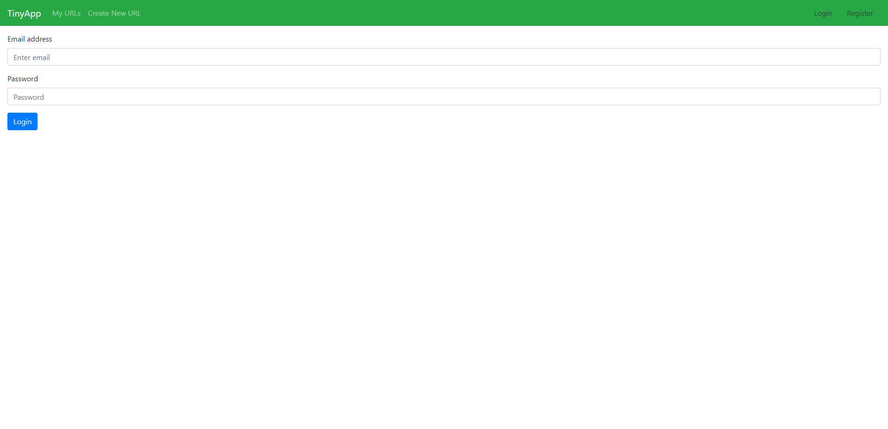
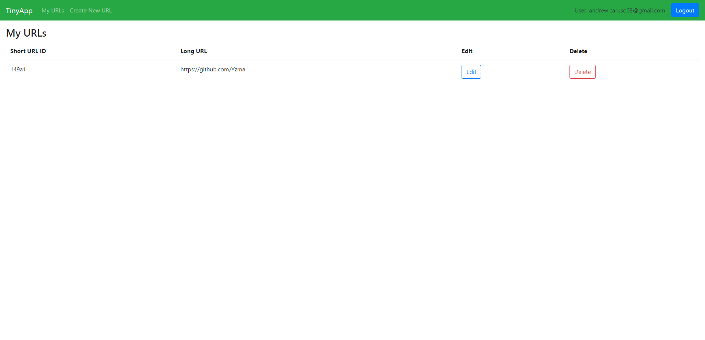
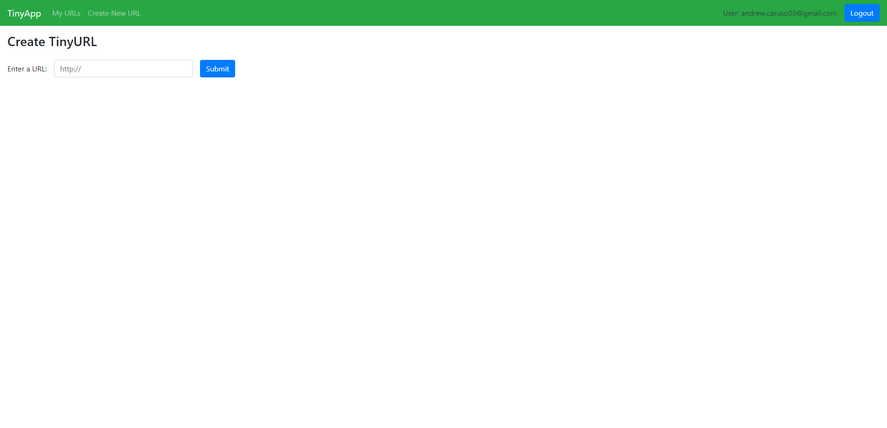
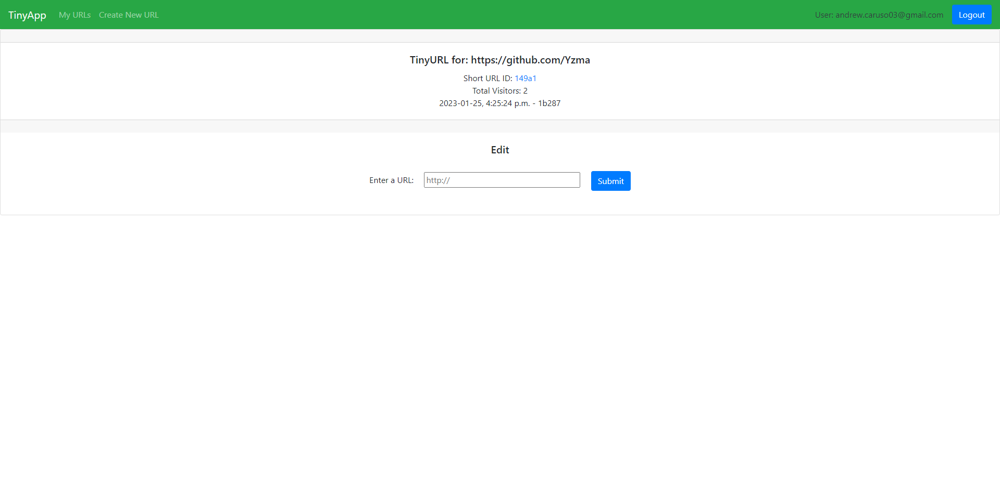

# TinyApp Project

TinyApp is a full stack web application built with Node and Express that allows users to shorten long URLs (à la bit.ly). Built with security in mind, TinyApp uses
encrypted cookies to keep users signed in (even after closing the browser) and even keeps tracks how many total and unique visitors visits your shortened links.

## Dependencies

- Node.js
- Express
- EJS
- bcryptjs
- cookie-session
- dotenv

## Getting Started

  1. Download or clone the project (`git clone git@github.com:Yzma/tinyapp.git`)
  2. Navigate into the project directory and install all dependencies by running the `npm install` command in your terminal
  3. Rename the file '.env.example' to '.env'
  4. Fill out all of the environment variables to your liking
  5. Run `npm run start` to start the web server

## Screenshots

## Login Page:

## My URLs:

## Create new URL:

## View URL:

